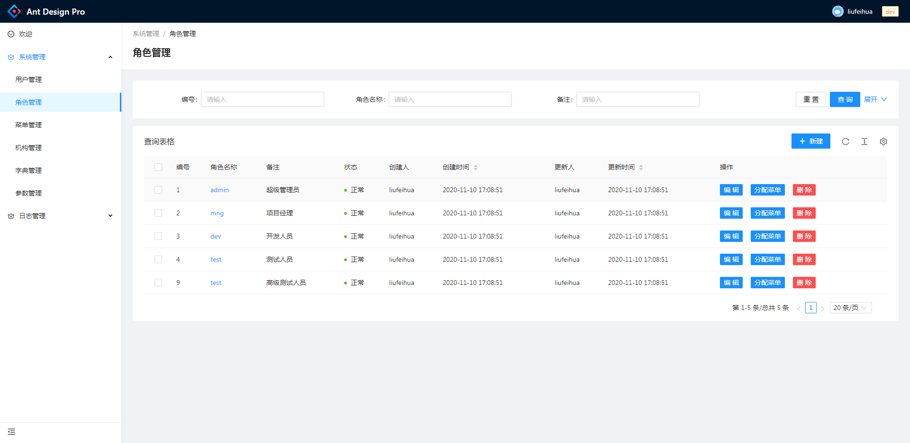
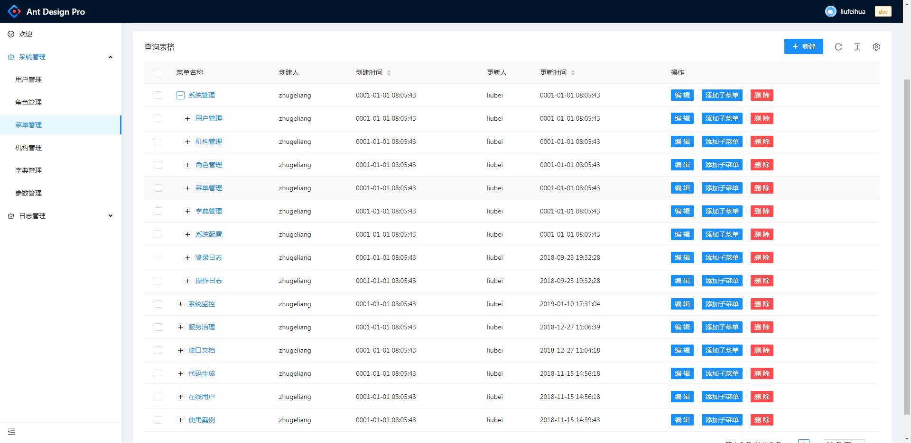
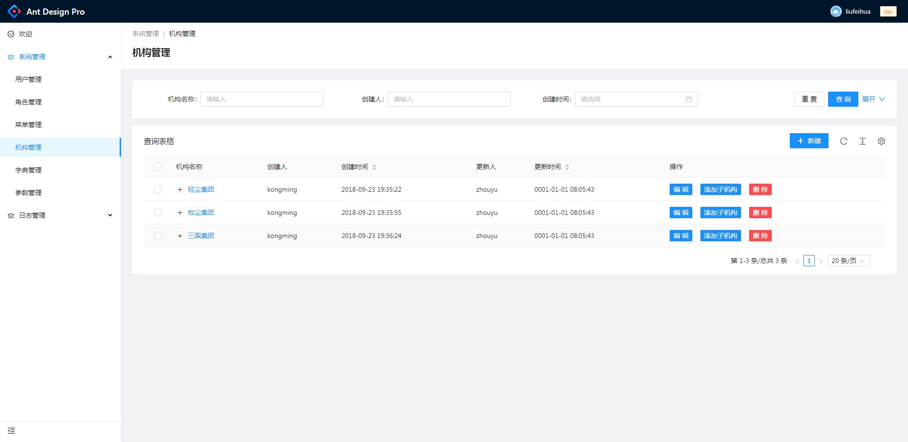
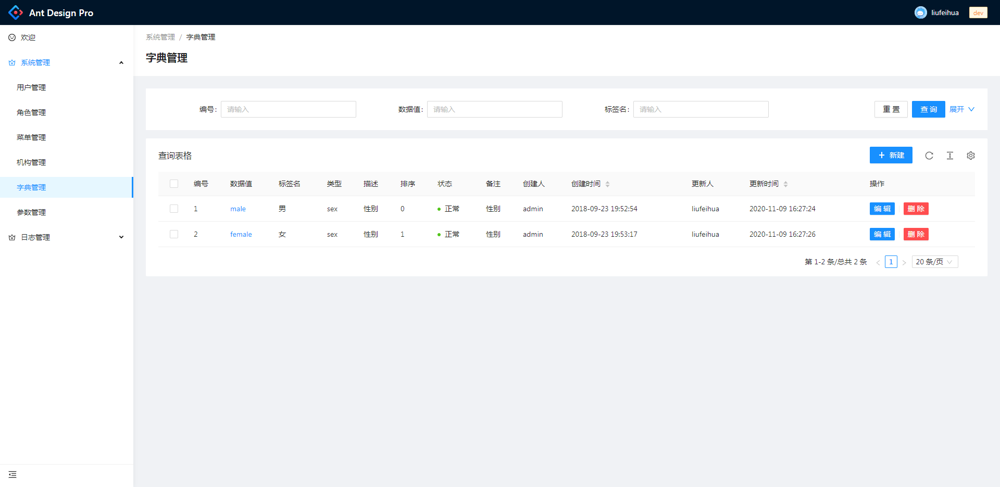
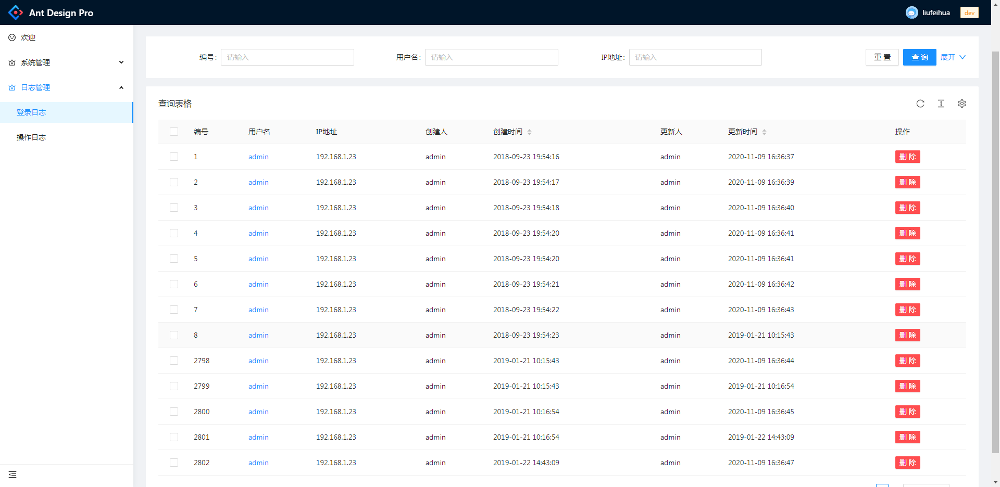

项目前端是基于 Ant Design Pro 来创建的，后端是基于 go-zero 来创建的一个前后端分离的管理系统

[如果喜欢 Element Admin UI 前端版本的，可以点击查看](https://github.com/feihua/go-zero-admin-vue)

# 1.安装 node_modules:

```shell
npm install
```

# 2.启动项目

```shell
npm run dev
```

# 3.项目预览

**预览地址**http://139.159.180.129:81/mall <span  style="color: red;"> 账号：admin 密码: 123456</span>

## 3.1 用户


## 3.2 角色




## 3.3 菜单



## 3.4 机构



## 3.5 字典



## 3.6 日志



