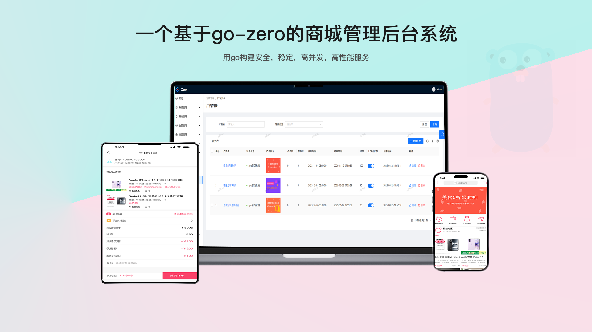

# Zero-Admin-UI 电商后台管理系统

>
> **Zero-Admin-UI** 是一个基于 React 实现的电商后台管理系统的前端项目。该项目涵盖了商品管理、订单管理、会员管理、促销管理、运营管理、内容管理、权限管理、设置等多个功能模块，为管理者提供了便捷高效的操作界面。




## 功能模块

1. **商品管理**: 提供对商品信息的增删改查操作，包括商品图片、价格、库存等。

2. **订单管理**: 实时监控订单状态，支持订单发货、取消等操作，并提供订单详细信息查看。

3. **会员管理**: 管理用户信息，包括注册用户、会员等级、积分等。

4. **促销管理**: 管理营销活动，包括满减、打折等促销策略的配置。

5. **运营管理**: 管理广告、推广等运营活动，提供界面化的操作。

6. **内容管理**: 管理网站内容，包括公告、资讯等，支持富文本编辑。

7. **权限管理**: 管理系统用户权限，确保系统安全性，提供角色和权限的配置。

8. **设置**: 对系统进行基本配置，包括支付方式、物流信息等。

## 技术栈

- **React**: 使用现代化的前端框架，提高开发效率和用户体验。

- **Ant Design**: 使用 Ant Design 组件库，构建美观、易用的用户界面。

- **React Router**: 负责前端路由管理，实现单页面应用。

- **Axios**: 处理与后端的 HTTP 请求，实现数据的异步获取和提交。

# 文档地址

[https://feihua.github.io/](https://feihua.github.io/)


# 1.安装依赖
> node 版本尽量选择<=16 的
```shell
npm install --legacy-peer-deps

```

# 2.启动项目

```shell
npm run dev
```

# 1.项目预览

**预览地址** http://129.204.203.29/mall <span  style="color: red;"> 账号：admin 密码: 123456</span>

**vue版本预览地址** http://129.204.203.29/vue/login <span  style="color: red;"> 账号：admin 密码: 123456</span>

